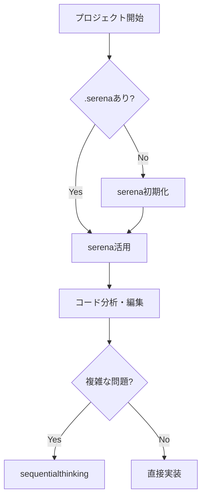
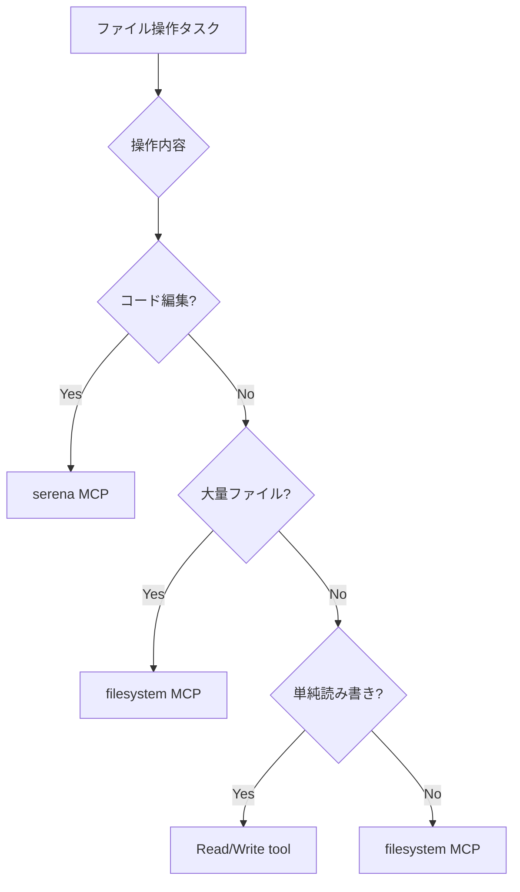
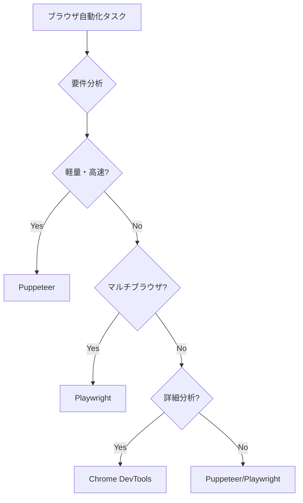
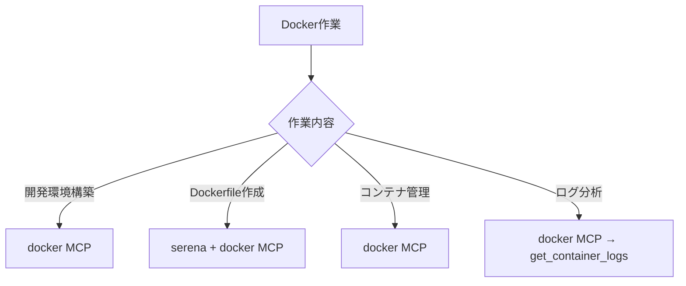

# CLAUDE.md - Claude Code MCPサーバー利用ガイド

**言語設定**: 日本語で回答してください

## 🚨 最重要: コード修正の絶対ルール

### ⚠️ Claude Code本体は絶対にコードを直接修正しない
**以下のルールを必ず守ってください：**

1. **複雑な修正が必要な場合**
   - PO Agent → Manager Agent → Developer Agents（並列処理）の順で実行
   - 高速化のため複数のDeveloper Agentを並列起動

2. **軽微な修正・単純な修正の場合**
   - 複雑でなくても、コードの修正については自身で**絶対に**行わない
   - 必ずDeveloper Agentに指示し、Developer Agentが実行
   - PO Agent経由でも、直接Developer Agentへの指示でも可

3. **例外（自分で実行可能）**
   - ファイル一覧表示
   - 単純なファイル読み込み（コード修正を伴わない）
   - 質問への回答（情報提供のみ）

### 判断基準フローチャート
```
タスク受信
    ↓
コード修正が必要？
    ├─ No → 自分で実行可能（Read、情報提供等）
    └─ Yes → 自分では絶対に実行しない
        ↓
        複雑なタスク？
        ├─ Yes → PO Agent起動（戦略決定）
        │           ↓
        │       Manager Agent起動（タスク配分計画）
        │           ↓
        │       複数Developer Agents並列起動（実装）
        │
        └─ No（軽微）→ Developer Agent起動（直接実装）
```

## 🎯 Quick Start - 最初にやること

### プロジェクト開始時の必須手順
```bash
# 1. プロジェクトディレクトリで.serenaの存在を確認
ls -la .serena

# 2. 存在しない場合は必ずserenaを初期化
mcp__serena__activate_project(project=".")

# 3. オンボーディングを実施
mcp__serena__check_onboarding_performed()
mcp__serena__onboarding()  # 未実施の場合

# 4. プロジェクト構造を把握
mcp__serena__get_symbols_overview()
```

## 📚 利用可能なMCPサーバー一覧

### 1. コード開発・分析系

#### 🔥 **serena** - インテリジェントコード分析【最重要】
```
プレフィックス: mcp__serena__
```
- **主要機能**:
  - シンボル検索・依存関係分析 (`find_symbol`, `find_referencing_symbols`)
  - コード編集・リファクタリング (`replace_symbol_body`, `insert_*_symbol`)
  - パターン検索 (`search_for_pattern`)
  - プロジェクト知識管理 (`read_memory`, `write_memory`)
- **必須使用場面**: 全てのコード作業の開始時

#### 🧠 **sequentialthinking** - 段階的問題解決
```
プレフィックス: mcp__sequentialthinking__
```
- **主要機能**: 複雑な問題の段階的分解と解決
- **使用場面**: アーキテクチャ設計、複雑なバグ解析、アルゴリズム設計

#### 🔧 **codex** - AIペアプログラミング
```
プレフィックス: mcp__codex__
```
- **主要機能**: 対話的なコード生成とリファクタリング
- **使用場面**: 複雑な実装タスク、コードレビュー

### 2. 情報検索・ドキュメント系

#### 📖 **context7** - ライブラリドキュメント
```
プレフィックス: mcp__context7__
```
- **主要機能**:
  - ライブラリID解決 (`resolve-library-id`)
  - ドキュメント取得 (`get-library-docs`)
- **使用場面**: React、Vue、Next.js等のフレームワーク利用時

#### 📚 **docset** - ローカルドキュメント検索
```
プレフィックス: mcp__docset__
```
- **主要機能**:
  - 言語仕様検索 (`search_docs`)
  - チートシート参照 (`search_cheatsheet`, `fetch_cheatsheet`)
  - APIリファレンス (`list_entries`)
- **使用場面**: 言語仕様、標準ライブラリ、CLIツールのリファレンス

#### 🔍 **kagi** - Web検索・要約
```
プレフィックス: mcp__kagi__
```
- **主要機能**:
  - Web検索 (`kagi_search_fetch`)
  - コンテンツ要約 (`kagi_summarizer`)
- **使用場面**: 最新情報、技術トレンド、一般的な調査

#### 📦 **deepwiki** - GitHubリポジトリ解析
```
プレフィックス: mcp__deepwiki__
```
- **主要機能**:
  - リポジトリ構造解析 (`read_wiki_structure`)
  - ドキュメント読解 (`read_wiki_contents`)
  - Q&A (`ask_question`)
- **使用場面**: オープンソースプロジェクトの理解

### 3. ファイル・システム操作系

#### 📂 **filesystem** - ファイルシステム操作
```
プレフィックス: mcp__filesystem__
```
- **主要機能**:
  - ファイル読み込み (`read_file`)
  - ファイル書き込み (`write_file`)
  - ファイル編集 (`edit_file`)
  - ディレクトリ操作 (`list_directory`, `create_directory`)
  - ファイル移動・コピー (`move_file`)
  - ファイル検索 (`search_files`)
  - ファイル情報取得 (`get_file_info`)
- **使用場面**:
  - 大量のファイル操作が必要な場合
  - ディレクトリ構造の管理
  - ファイルの一括処理
  - バックアップやコピー作業
- **serenaとの使い分け**:
  - **serena優先**: コード解析・編集の場合
  - **filesystem優先**: 非コードファイル操作、大量ファイル処理の場合

### 4. インフラ・DevOps系

#### 🏗️ **terraform** - Infrastructure as Code
```
プレフィックス: mcp__terraform__
```
- **主要機能**:
  - モジュール検索 (`search_modules`)
  - プロバイダー詳細 (`get_provider_details`)
  - ポリシー管理 (`search_policies`)
- **使用場面**: AWS/Azure/GCPのインフラ構築

#### 🐳 **docker** - コンテナ管理
```
プレフィックス: mcp__docker__
```
- **主要機能**:
  - コンテナ操作 (`list_containers`, `start_container`, `stop_container`)
  - イメージ管理 (`list_images`, `pull_image`, `build_image`)
  - ボリューム管理 (`list_volumes`, `create_volume`)
  - ネットワーク管理 (`list_networks`, `create_network`)
  - ログ取得 (`get_container_logs`)
- **使用場面**:
  - Dockerコンテナの起動・停止・管理
  - Docker Composeプロジェクトの管理
  - コンテナログの確認とデバッグ
  - 開発環境の構築と管理
- **必須使用条件**:
  - Dockerfileの作成・編集時
  - docker-compose.ymlの設定時
  - コンテナベースの開発環境構築
  - マイクロサービスのローカル実行

#### 🎨 **puppeteer** - ヘッドレスブラウザ制御
```
プレフィックス: mcp__puppeteer__
```
- **主要機能**:
  - ページナビゲーション (`navigate`, `goto`)
  - スクリーンショット取得 (`screenshot`)
  - PDF生成 (`pdf`)
  - 要素操作 (`click`, `type`, `select`)
  - JavaScript実行 (`evaluate`)
  - ページ情報取得 (`content`, `title`, `url`)
- **使用場面**:
  - Webページの自動スクリーンショット取得
  - PDFレポート生成
  - Webサイトのクローリング・スクレイピング
  - フォーム自動入力とテスト
  - SPAアプリケーションのE2Eテスト
- **必須使用条件**:
  - 軽量なブラウザ自動化が必要な場合
  - Node.js環境でのブラウザ制御
  - CI/CD環境でのヘッドレステスト
  - パフォーマンス重視のスクレイピング

### 5. ブラウザ自動化系

#### 🎭 **playwright** - フルブラウザ自動化
```
プレフィックス: mcp__playwright__
```
- **主要機能**:
  - ページ操作 (`browser_navigate`, `browser_click`)
  - フォーム入力 (`browser_fill_form`)
  - スクリーンショット (`browser_take_screenshot`)
  - マルチブラウザ対応（Chrome, Firefox, Safari）
- **使用場面**:
  - E2Eテスト実装
  - クロスブラウザテスト
  - 複雑なWebアプリケーションの自動化
- **優先使用条件**:
  - マルチブラウザ対応が必要な場合
  - 複雑なE2Eテストシナリオ
  - TypeScript/JavaScript以外の言語からの利用

#### 🌐 **chrome-devtools** - Chrome DevTools制御
```
プレフィックス: mcp__chrome-devtools__
```
- **主要機能**:
  - ページ分析 (`take_snapshot`)
  - パフォーマンス計測 (`performance_start_trace`)
  - ネットワーク監視 (`list_network_requests`)
  - リアルタイムデバッグ
- **使用場面**:
  - Webアプリデバッグ
  - パフォーマンス分析
  - ネットワーク問題の診断
- **優先使用条件**:
  - Chrome特有の機能が必要な場合
  - 詳細なパフォーマンス分析
  - DevToolsプロトコルの直接利用

## 🚀 タスク別MCP利用ガイド

### コード作業フロー


### 情報検索の優先順位
1. **コード内**: `serena` → シンボル検索
2. **ライブラリ**: `context7` → 公式ドキュメント
3. **GitHub**: `deepwiki` → リポジトリ解析
4. **言語仕様**: `docset` → ローカルリファレンス
5. **一般情報**: `kagi` → Web検索

### ファイル操作の選択基準


### ブラウザ自動化の選択基準


### コンテナ操作フロー


### 複雑なタスクの分解
1. **問題分析**: sequentialthinking MCPで段階的に問題を分解
2. **コード調査**: serena MCPでシンボル検索と依存関係を分析
3. **実装**: serena MCPでシンボル単位の編集を実施

## 💡 ベストプラクティス

### serenaの効果的な活用
- **❌ 悪い例**: ファイル全体を読み込む（Readツール使用）
- **✅ 良い例**: serena MCPで必要なシンボルだけを検索・読込

### 並列処理の活用
- 複数のMCP操作を同時実行して効率化
- context7でライブラリドキュメント取得
- kagiでWeb検索
- serenaでシンボル検索
- これらを並列実行可能

### メモリ管理
- **永続化**: serena MCPのwrite_memoryでプロジェクト知識を保存
- **参照**: serena MCPのread_memoryで後から情報を取得

### ファイル操作の効率化
- **コード編集**: serena MCPのシンボル単位編集
- **一括処理**: filesystem MCPで複数ファイル操作
- **バックアップ**: filesystem MCPでディレクトリ単位のコピー
- **検索**: filesystem MCPのsearch_filesで高速検索

### Docker環境の効率的な管理
- **状態確認**: docker MCPでコンテナ一覧を確認してから操作
- **環境構築**: Docker Composeで開発環境を一括起動
- **ログ監視**: コンテナログを継続的に監視してデバッグ
- **イメージ管理**: 必要に応じてイメージをビルド・管理

### ブラウザ自動化の使い分け
- **軽量タスク**: Puppeteer MCPを使用
  - スクリーンショット取得
  - PDF生成
  - 簡単なWebスクレイピング
- **複雑なE2Eテスト**: Playwright MCPを使用
  - マルチブラウザテスト
  - 複雑なフォーム操作
  - 高度なE2Eテストシナリオ
- **パフォーマンス分析**: Chrome DevTools MCPを使用
  - 詳細なパフォーマンス計測
  - ネットワーク分析
  - Chrome特有の機能利用

## 🤖 Agent System Usage - 階層的エージェント管理

### 🎯 必須: PO→Manager→Developerの階層的Agentシステム
**小さな修正以外は、必ずPO→Manager→Developerの階層的Agentシステムを使用してください。**

#### 📂 Agent定義ファイルの場所
```
agents/
├── po-agent.md        # PO Agent定義
├── manager-agent.md   # Manager Agent定義
└── developer-agent.md # Developer Agent定義
```

#### 📋 実行順序の厳守

##### 1. PO Agent起動（戦略決定）
- agents/po-agent.mdの定義を使用
- ユーザー要求を分析し、戦略を決定
- Managerへの指示を作成

##### 2. Manager Agent起動（タスク配分）
- agents/manager-agent.mdの定義を使用
- POからの指示を受けてタスク分析
- Developer向けの配分計画を作成
- 実際のDeveloper起動はClaude Codeが実行

##### 3. Developer Agents並列起動（実装）
- agents/developer-agent.mdの定義を使用
- Managerの計画に基づいて必ず並列起動
- 各Developerに異なる役割とタスクを割り当て
- dev1〜dev4まで最大4つの並列実行

### 🚀 並列実行の鉄則
- **Developer起動は必ず1つのメッセージで同時実行**
- **独立タスクは絶対に並列化**
- **段階的実行でも各段階内は並列化**

### 📊 Manager計画の実行方法

#### 【並列実行可能】の場合
- 4つの独立したタスクを1メッセージで同時起動
- dev1〜dev4を並列実行

#### 【段階的実行】の場合
- 第1段階: dev1,dev2を同時起動（1メッセージで）
- 第1段階完了後、第2段階: dev3,dev4を同時起動（1メッセージで）
- 各段階内では必ず並列実行

#### 【順次実行】の場合（稀）
- 強い依存関係がある場合のみ使用
- dev1完了後にdev2、dev2完了後にdev3という順序
- できる限り避けて並列化を検討

### ✅ 直接実装可能な例外
- 単純なファイル読み込み（1-2ファイル）
- 1行程度の簡単な修正
- 単純な質問への回答
- ファイル一覧表示

### ❌ 必ずAgentを使用すべきケース
- 新機能実装
- 複数ファイルのバグ修正
- リファクタリング
- テスト実装
- ドキュメント作成（複数ファイル）
- 複雑な調査・分析

### 🔑 各Agentの役割と責任

#### PO Agent（戦略決定者）
- **責任**: プロジェクト全体の戦略と方向性
- **使用ツール**: serena MCP（俯瞰的分析）、sequentialthinking、kagi
- **禁止**: 実装、ファイル編集、Developer起動

#### Manager Agent（タスク管理者）
- **責任**: タスク分割と依存関係管理、配分計画作成
- **使用ツール**: serena MCP（詳細分析）、sequentialthinking
- **禁止**: 実装、ファイル編集、Developer起動（計画のみ返す）
- **重要**: Developerの起動はClaude Codeが実行

#### Developer Agent（実装者）
- **責任**: 実際の作業実行
- **使用ツール**: 全てのツール（Write、Edit、Bash、docker、puppeteer、filesystem等）
- **特性**: dev1-4それぞれが異なる専門性を持つ
- **MCP使用の優先順位**:
  - コード編集: serena MCP優先
  - ファイル操作: filesystem MCPを活用
  - Docker環境構築: docker MCPを活用
  - ブラウザ自動化: puppeteer/playwright MCPを選択

### 📝 Agent間のコンテキスト管理
- **PO→Manager**: 戦略的指示とユーザー要求を伝達
- **Manager→Claude Code**: タスク配分計画を返す
- **Claude Code→Developer**: 計画に基づいてDeveloperを起動
- **Developer→Manager**: 完了報告
- **Manager→PO**: プロジェクト完了報告

### ⚡ パフォーマンス最適化のポイント
1. **Agent定義ファイルは最初に1回だけ読み込む**
2. **複数Developerは必ず同時起動**
3. **不要な往復を避ける（明確な指示）**
4. **serena MCPで効率的にコード分析**

## ⚠️ 重要な注意事項

### 必須ルール
1. **serena最優先**: コード作業は必ずserenaから開始
2. **トークン効率**: ファイル全体読み込みは最終手段
3. **並列実行**: 独立したタスクは同時実行
4. **コンテキスト管理**: プロジェクト知識はメモリに保存

### エラー時の対処
- **シンボルが見つからない**: serenaを再アクティベート
- **ドキュメントが古い**: context7で最新版を確認
- **パフォーマンス問題**: sequentialthinkingで分析

### セキュリティ
- 認証情報は絶対にコミットしない
- 環境変数は.envファイルで管理
- APIキーは暗号化して保存

## 📊 MCP利用統計の目安

| タスク種別 | 推奨MCP | 使用頻度 |
|---------|--------|---------|
| コード編集 | serena | 90% |
| ライブラリ調査 | context7 | 70% |
| 問題解決 | sequentialthinking | 40% |
| Docker環境管理 | docker | 40% |
| ファイル操作 | filesystem | 35% |
| Web検索 | kagi | 30% |
| ブラウザ自動化 | puppeteer | 25% |
| テスト自動化 | playwright | 20% |
| パフォーマンス分析 | chrome-devtools | 15% |

## 🌳 Git Worktree を使用した並行開発

### 基本概念と制約
Git Worktreeは複数のブランチを同時に作業できる仕組みです。ただし、**Claude Codeは親ディレクトリ（`..`）にアクセスできない**ため、通常とは異なる方法で運用します。

### ⚠️ 重要な制約
- **親ディレクトリへのアクセス不可**: Claude Codeは`../`にアクセスできません
- **解決策**: メインリポジトリ内のサブディレクトリとしてworktreeを作成

### 📁 推奨ディレクトリ構造
```
your-project/              # メインリポジトリ（main/masterブランチ）
├── src/                   # ソースコード
├── tests/                 # テスト
├── wt-feat/              # worktreeディレクトリ（プレフィックス: wt-）
│   ├── feature-a/        # feature/feature-aブランチ
│   └── bugfix-123/       # bugfix/issue-123ブランチ
└── wt-hotfix/            # 緊急修正用worktree
    └── critical-fix/     # hotfix/critical-fixブランチ
```

### 🎯 Worktree作成の命名規則

#### 基本フォーマット
```bash
git worktree add wt-{カテゴリ}/{ブランチ名} {実際のブランチパス}
```

#### カテゴリ別の命名例
```bash
# 機能開発
git worktree add wt-feat/user-auth feature/user-authentication
git worktree add wt-feat/8838-add-option feat/8838-add-keep-filler-option

# バグ修正
git worktree add wt-fix/memory-leak bugfix/memory-leak-issue
git worktree add wt-fix/issue-456 bugfix/issue-456

# ホットフィックス
git worktree add wt-hotfix/critical hotfix/critical-security-patch

# 実験的開発
git worktree add wt-exp/new-architecture experimental/new-architecture

# リリース準備
git worktree add wt-release/v2.0.0 release/v2.0.0
```

### 📋 Worktree操作ガイド

#### 1. 新規Worktree作成
```bash
# まず作業ディレクトリを確認
pwd  # メインリポジトリのルートであることを確認

# 既存のworktreeを確認
git worktree list

# 新しいworktreeを作成（既存ブランチから）
git worktree add wt-feat/payment feature/payment-integration

# 新しいworktreeを作成（新規ブランチ作成と同時に）
git worktree add -b feature/new-feature wt-feat/new-feature

# リモートブランチから作成
git worktree add wt-feat/remote-branch origin/feature/remote-branch
```

#### 2. Worktreeでの作業
```bash
# worktreeに移動
cd wt-feat/payment

# 通常通り開発作業を実施
git status
git add .
git commit -m "feat: implement payment gateway"
git push origin feature/payment-integration

# メインリポジトリに戻る
cd ../..
```

#### 3. Worktreeの管理
```bash
# 全worktreeの一覧表示
git worktree list

# 不要なworktreeの削除（作業完了後）
git worktree remove wt-feat/payment

# 強制削除（未コミットの変更がある場合）
git worktree remove --force wt-feat/payment

# 削除済みworktreeのクリーンアップ
git worktree prune
```

### ⚡ ベストプラクティス

#### DO（推奨事項）
- ✅ **プレフィックス使用**: 必ず`wt-`プレフィックスを使用してworktreeを識別
- ✅ **カテゴリ分け**: feat/fix/hotfix等でディレクトリを整理
- ✅ **定期的なクリーンアップ**: 使用済みworktreeは削除
- ✅ **ブランチ名の一貫性**: worktreeディレクトリ名とブランチ名を対応させる
- ✅ **作業前の確認**: `git worktree list`で既存worktreeを確認

#### DON'T（避けるべき事項）
- ❌ **親ディレクトリへの作成**: `../`にworktreeを作成しない
- ❌ **ネストしたworktree**: worktree内にworktreeを作成しない
- ❌ **同じブランチの複数worktree**: 1つのブランチに複数のworktreeを作成しない
- ❌ **長期間の放置**: 使用しないworktreeを残さない

### 🔍 トラブルシューティング

#### worktreeが作成できない場合
```bash
# エラー: ブランチが既に別のworktreeで使用中
git worktree list  # 既存のworktreeを確認
git worktree remove {既存のworktree}  # 不要なworktreeを削除

# エラー: ディレクトリが既に存在
rm -rf wt-feat/existing-dir  # 既存ディレクトリを削除
git worktree add wt-feat/existing-dir feature/branch
```

#### worktreeが削除できない場合
```bash
# 未コミットの変更を確認
cd wt-feat/branch
git status
git stash  # 変更を一時保存

# メインディレクトリに戻って削除
cd ../..
git worktree remove wt-feat/branch
```

#### worktreeの状態がおかしくなった場合
```bash
# worktreeの修復
git worktree repair

# 全worktreeの検証と修復
git worktree repair --all

# 無効なworktreeの削除
git worktree prune
```

### 📊 Worktree使用時のserena連携

Worktreeで作業する場合、serenaの再初期化が必要です：

```bash
# worktreeに移動
cd wt-feat/new-feature

# serenaを再初期化（worktreeごとに必要）
mcp__serena__activate_project(project=".")

# 開発作業を実施
# ...

# メインリポジトリに戻る
cd ../..

# メインリポジトリのserenaを再アクティベート
mcp__serena__activate_project(project=".")
```

## 🔄 定期メンテナンス

### 日次
- serenaプロジェクトの再アクティベート（大規模変更後）
- 使用済みworktreeの削除（`git worktree prune`）

### 週次
- メモリファイルの整理と更新
- 未使用のMCPリソースのクリーンアップ
- worktree一覧の確認と整理（`git worktree list`）

### 月次
- MCPサーバーの更新確認
- パフォーマンス最適化の見直し
