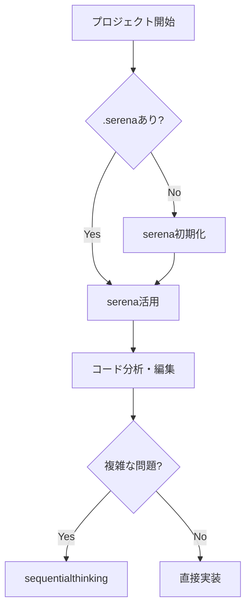

# CLAUDE.md - Claude Code MCPサーバー利用ガイド

**言語設定**: 日本語で回答してください

## 🎯 Quick Start - 最初にやること

### プロジェクト開始時の必須手順
```bash
# 1. プロジェクトディレクトリで.serenaの存在を確認
ls -la .serena

# 2. 存在しない場合は必ずserenaを初期化
mcp__serena__activate_project(project=".")

# 3. オンボーディングを実施
mcp__serena__check_onboarding_performed()
mcp__serena__onboarding()  # 未実施の場合

# 4. プロジェクト構造を把握
mcp__serena__get_symbols_overview()
```

## 📚 利用可能なMCPサーバー一覧

### 1. コード開発・分析系

#### 🔥 **serena** - インテリジェントコード分析【最重要】
```
プレフィックス: mcp__serena__
```
- **主要機能**:
  - シンボル検索・依存関係分析 (`find_symbol`, `find_referencing_symbols`)
  - コード編集・リファクタリング (`replace_symbol_body`, `insert_*_symbol`)
  - パターン検索 (`search_for_pattern`)
  - プロジェクト知識管理 (`read_memory`, `write_memory`)
- **必須使用場面**: 全てのコード作業の開始時

#### 🧠 **sequentialthinking** - 段階的問題解決
```
プレフィックス: mcp__sequentialthinking__
```
- **主要機能**: 複雑な問題の段階的分解と解決
- **使用場面**: アーキテクチャ設計、複雑なバグ解析、アルゴリズム設計

#### 🔧 **codex** - AIペアプログラミング
```
プレフィックス: mcp__codex__
```
- **主要機能**: 対話的なコード生成とリファクタリング
- **使用場面**: 複雑な実装タスク、コードレビュー

### 2. 情報検索・ドキュメント系

#### 📖 **context7** - ライブラリドキュメント
```
プレフィックス: mcp__context7__
```
- **主要機能**:
  - ライブラリID解決 (`resolve-library-id`)
  - ドキュメント取得 (`get-library-docs`)
- **使用場面**: React、Vue、Next.js等のフレームワーク利用時

#### 📚 **docset** - ローカルドキュメント検索
```
プレフィックス: mcp__docset__
```
- **主要機能**:
  - 言語仕様検索 (`search_docs`)
  - チートシート参照 (`search_cheatsheet`, `fetch_cheatsheet`)
  - APIリファレンス (`list_entries`)
- **使用場面**: 言語仕様、標準ライブラリ、CLIツールのリファレンス

#### 🔍 **kagi** - Web検索・要約
```
プレフィックス: mcp__kagi__
```
- **主要機能**:
  - Web検索 (`kagi_search_fetch`)
  - コンテンツ要約 (`kagi_summarizer`)
- **使用場面**: 最新情報、技術トレンド、一般的な調査

#### 📦 **deepwiki** - GitHubリポジトリ解析
```
プレフィックス: mcp__deepwiki__
```
- **主要機能**:
  - リポジトリ構造解析 (`read_wiki_structure`)
  - ドキュメント読解 (`read_wiki_contents`)
  - Q&A (`ask_question`)
- **使用場面**: オープンソースプロジェクトの理解

### 3. インフラ・DevOps系

#### 🏗️ **terraform** - Infrastructure as Code
```
プレフィックス: mcp__terraform__
```
- **主要機能**:
  - モジュール検索 (`search_modules`)
  - プロバイダー詳細 (`get_provider_details`)
  - ポリシー管理 (`search_policies`)
- **使用場面**: AWS/Azure/GCPのインフラ構築

### 4. ブラウザ自動化系

#### 🎭 **playwright** - ブラウザ自動化
```
プレフィックス: mcp__playwright__
```
- **主要機能**:
  - ページ操作 (`browser_navigate`, `browser_click`)
  - フォーム入力 (`browser_fill_form`)
  - スクリーンショット (`browser_take_screenshot`)
- **使用場面**: E2Eテスト、Webスクレイピング

#### 🌐 **chrome-devtools** - Chrome DevTools制御
```
プレフィックス: mcp__chrome-devtools__
```
- **主要機能**:
  - ページ分析 (`take_snapshot`)
  - パフォーマンス計測 (`performance_start_trace`)
  - ネットワーク監視 (`list_network_requests`)
- **使用場面**: Webアプリデバッグ、パフォーマンス分析

## 🚀 タスク別MCP利用ガイド

### コード作業フロー


### 情報検索の優先順位
1. **コード内**: `serena` → シンボル検索
2. **ライブラリ**: `context7` → 公式ドキュメント
3. **GitHub**: `deepwiki` → リポジトリ解析
4. **言語仕様**: `docset` → ローカルリファレンス
5. **一般情報**: `kagi` → Web検索

### 複雑なタスクの分解
```python
# 1. 問題分析
mcp__sequentialthinking__sequentialthinking(
    thought="問題の本質を理解",
    total_thoughts=5
)

# 2. コード調査
mcp__serena__find_symbol(name_path="TargetClass")
mcp__serena__find_referencing_symbols(...)

# 3. 実装
mcp__serena__replace_symbol_body(...)
```

## 💡 ベストプラクティス

### serenaの効果的な活用
```python
# ❌ 悪い例：ファイル全体を読む
Read(file_path="/path/to/file.ts")

# ✅ 良い例：必要な部分だけ読む
mcp__serena__get_symbols_overview(relative_path="file.ts")
mcp__serena__find_symbol(
    name_path="specificFunction",
    include_body=True
)
```

### 並列処理の活用
```python
# 複数のMCP操作を同時実行
[
    mcp__context7__get_library_docs(library="react"),
    mcp__kagi__kagi_search_fetch(queries=["react best practices"]),
    mcp__serena__find_symbol(name_path="Component")
]
```

### メモリ管理
```python
# プロジェクト知識の永続化
mcp__serena__write_memory(
    memory_name="architecture_decisions",
    content="技術選定の理由と設計方針"
)

# 後で参照
mcp__serena__read_memory(memory_file_name="architecture_decisions.md")
```

## 🤖 Agent System Usage - 階層的エージェント管理

### 🎯 必須: PO→Manager→Developerの階層的Agentシステム
**小さな修正以外は、必ずPO→Manager→Developerの階層的Agentシステムを使用してください。**

#### 📂 Agent定義ファイルの場所
```
agents/
├── po-agent.md        # PO Agent定義
├── manager-agent.md   # Manager Agent定義
└── developer-agent.md # Developer Agent定義
```

#### 📋 実行順序の厳守

##### 1. PO Agent起動（戦略決定）
```python
# agents/po-agent.mdの内容を読み込んで使用
Task(
    subagent_type="po-agent",
    description="PO Agent - 戦略決定",
    prompt="""
    [agents/po-agent.mdの内容を含める]

    ユーザー要求：{user_request}

    戦略を決定し、Managerへの指示を作成してください。
    """
)
```

##### 2. Manager Agent起動（タスク配分）
```python
# agents/manager-agent.mdの内容を読み込んで使用
Task(
    subagent_type="manager-agent",
    description="Manager Agent - タスク配分",
    prompt="""
    [agents/manager-agent.mdの内容を含める]

    POからの指示：{po_instructions}

    タスク配分計画を作成してください。
    """
)
```

##### 3. Developer Agents並列起動（実装）
```python
# agents/developer-agent.mdの内容を読み込んで使用
# Managerの計画に基づいて必ず並列起動（1つのメッセージで同時に）
[
    Task(
        subagent_type="developer-agent",
        description="Developer1 - {役割}",
        prompt="""
        [agents/developer-agent.mdの内容を含める]

        あなたはdev1です。
        タスク：{task1}
        """
    ),
    Task(
        subagent_type="developer-agent",
        description="Developer2 - {役割}",
        prompt="""
        [agents/developer-agent.mdの内容を含める]

        あなたはdev2です。
        タスク：{task2}
        """
    ),
    # dev3, dev4も同様に並列起動
]
```

### 🚀 並列実行の鉄則
- **Developer起動は必ず1つのメッセージで同時実行**
- **独立タスクは絶対に並列化**
- **段階的実行でも各段階内は並列化**

### 📊 Manager計画の実行方法

#### 【並列実行可能】の場合
```python
# 4つの独立したタスクを同時起動
[Task(dev1), Task(dev2), Task(dev3), Task(dev4)]  # 1メッセージで同時
```

#### 【段階的実行】の場合
```python
# 第1段階: dev1,dev2を同時起動
[Task(dev1), Task(dev2)]  # 1メッセージで同時

# 完了後、第2段階: dev3,dev4を同時起動
[Task(dev3), Task(dev4)]  # 1メッセージで同時
```

#### 【順次実行】の場合（稀）
```python
# 強い依存関係がある場合のみ順次実行
Task(dev1)  # 完了後
Task(dev2)  # 完了後
Task(dev3)
```

### ✅ 直接実装可能な例外
- 単純なファイル読み込み（1-2ファイル）
- 1行程度の簡単な修正
- 単純な質問への回答
- ファイル一覧表示

### ❌ 必ずAgentを使用すべきケース
- 新機能実装
- 複数ファイルのバグ修正
- リファクタリング
- テスト実装
- ドキュメント作成（複数ファイル）
- 複雑な調査・分析

### 🔑 各Agentの役割と責任

#### PO Agent（戦略決定者）
- **責任**: プロジェクト全体の戦略と方向性
- **使用ツール**: serena MCP（俯瞰的分析）、sequentialthinking、kagi
- **禁止**: 実装、ファイル編集、Developer起動

#### Manager Agent（タスク管理者）
- **責任**: タスク分割と依存関係管理、配分計画作成
- **使用ツール**: serena MCP（詳細分析）、sequentialthinking
- **禁止**: 実装、ファイル編集、Developer起動（計画のみ返す）
- **重要**: Developerの起動はClaude Codeが実行

#### Developer Agent（実装者）
- **責任**: 実際の作業実行
- **使用ツール**: 全てのツール（Write、Edit、Bash等）
- **特性**: dev1-4それぞれが異なる専門性を持つ

### 📝 Agent間のコンテキスト管理
- **PO→Manager**: 戦略的指示とユーザー要求を伝達
- **Manager→Claude Code**: タスク配分計画を返す
- **Claude Code→Developer**: 計画に基づいてDeveloperを起動
- **Developer→Manager**: 完了報告
- **Manager→PO**: プロジェクト完了報告

### ⚡ パフォーマンス最適化のポイント
1. **Agent定義ファイルは最初に1回だけ読み込む**
2. **複数Developerは必ず同時起動**
3. **不要な往復を避ける（明確な指示）**
4. **serena MCPで効率的にコード分析**

## ⚠️ 重要な注意事項

### 必須ルール
1. **serena最優先**: コード作業は必ずserenaから開始
2. **トークン効率**: ファイル全体読み込みは最終手段
3. **並列実行**: 独立したタスクは同時実行
4. **コンテキスト管理**: プロジェクト知識はメモリに保存

### エラー時の対処
- **シンボルが見つからない**: serenaを再アクティベート
- **ドキュメントが古い**: context7で最新版を確認
- **パフォーマンス問題**: sequentialthinkingで分析

### セキュリティ
- 認証情報は絶対にコミットしない
- 環境変数は.envファイルで管理
- APIキーは暗号化して保存

## 📊 MCP利用統計の目安

| タスク種別 | 推奨MCP | 使用頻度 |
|---------|--------|---------|
| コード編集 | serena | 90% |
| ライブラリ調査 | context7 | 70% |
| 問題解決 | sequentialthinking | 40% |
| Web検索 | kagi | 30% |
| テスト自動化 | playwright | 20% |

## 🔄 定期メンテナンス

### 日次
- serenaプロジェクトの再アクティベート（大規模変更後）

### 週次
- メモリファイルの整理と更新
- 未使用のMCPリソースのクリーンアップ

### 月次
- MCPサーバーの更新確認
- パフォーマンス最適化の見直し
