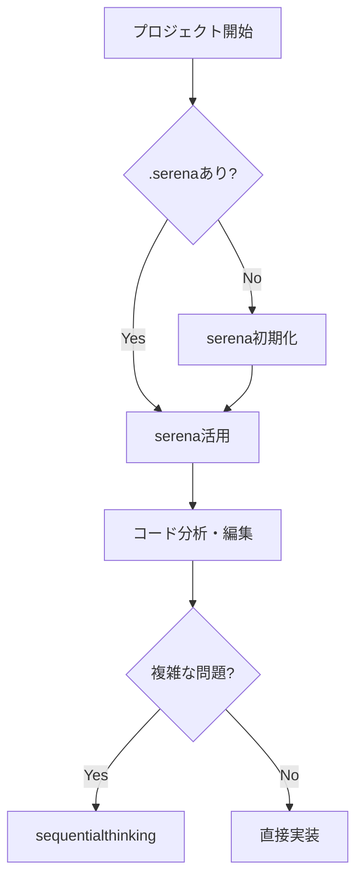
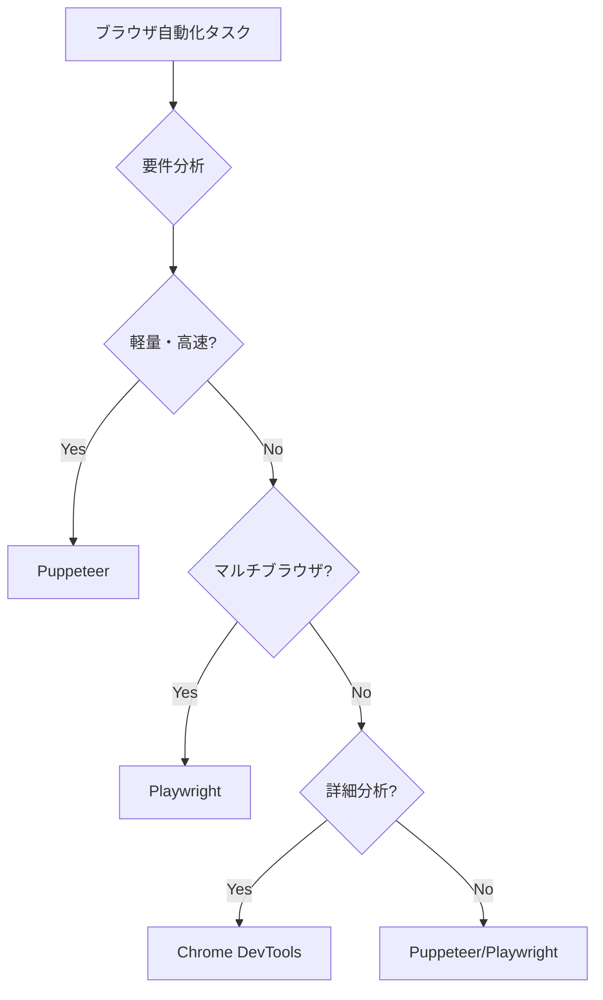
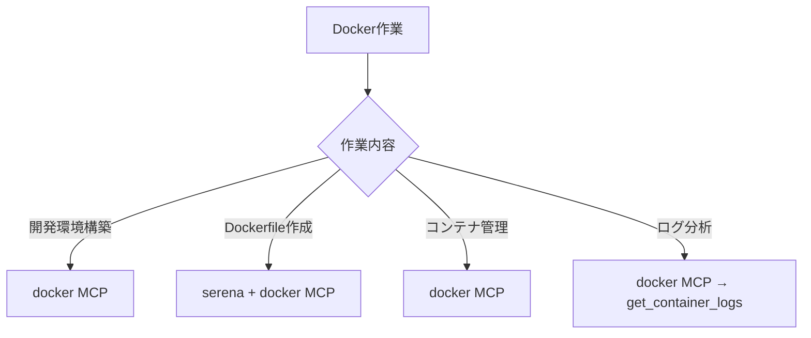

# CLAUDE.md - Claude Code MCPサーバー利用ガイド

**言語設定**: 日本語で回答してください

## 🚨 最重要: コード修正の絶対ルール

### ⚠️ Claude Code本体は絶対にコードを直接修正しない
**以下のルールを必ず守ってください：**

1. **複雑な修正が必要な場合**
   - PO Agent → Manager Agent → Developer Agents（並列処理）の順で実行
   - 高速化のため複数のDeveloper Agentを並列起動
   - **PO AgentがWorktree管理を担当**

2. **軽微な修正・単純な修正の場合**
   - 複雑でなくても、コードの修正については自身で**絶対に**行わない
   - 必ずDeveloper Agentに指示し、Developer Agentが実行
   - PO Agent経由でも、直接Developer Agentへの指示でも可
   - **Developer Agentに直接指示する場合は、現在のworktree情報を渡すこと**

3. **例外（自分で実行可能）**
   - ファイル一覧表示
   - 単純なファイル読み込み（コード修正を伴わない）
   - 質問への回答（情報提供のみ）

### 🌳 Worktree管理の原則

#### Claude Code本体の責任
1. **新規作業の判断**
   - 新しい、既存作業と関係ない作業か判断
   - 新規作業の場合、ユーザーに確認してworktree作成を提案

2. **Worktree情報の伝達**
   - **PO Agent使用時**: worktree作成をPO Agentに任せる
   - **Developer Agent直接使用時**: 現在のworktree名をDeveloper Agentに渡す

3. **絶対禁止事項**
   - 勝手にworktreeを作成しない（必ずユーザー確認）
   - 勝手にworktreeを削除しない

### 🚫 Git操作の絶対禁止

**Claude Code本体およびすべてのAgentは以下のGit操作を絶対に実行しない：**

- **絶対禁止**: `git add`、`git commit`、`git push`、`git merge`、`git rebase`等の書き込み操作
- **理由**: Git操作はユーザーまたは専門の担当者が手動で行うべき重要な操作
- **例外（読み取り専用のみ許可）**:
  - `git status` - 状態確認
  - `git diff` - 差分確認
  - `git log` - ログ確認
  - `git branch` - ブランチ一覧確認
  - `git worktree list` - worktree一覧確認

**重要な注意事項：**
- コード実装が完了しても、git add/commitは**絶対に実行しない**
- ユーザーがGitコミットを明示的に依頼しても、丁重に断り、手動での実行を推奨する
- この禁止事項はClaude Code本体、PO Agent、Manager Agent、Developer Agentすべてに適用される

### 判断基準フローチャート
```
タスク受信
    ↓
コード修正が必要？
    ├─ No → 自分で実行可能（Read、情報提供等）
    └─ Yes → 自分では絶対に実行しない
        ↓
        新規作業か既存作業か？
        ├─ 新規 → ユーザーに確認してworktree作成
        └─ 既存 → 既存worktree名を把握
        ↓
        複雑なタスク？
        ├─ Yes → PO Agent起動（戦略決定＋Worktree管理）
        │           ↓
        │       Manager Agent起動（タスク配分計画＋Worktree情報伝達）
        │           ↓
        │       複数Developer Agents並列起動（Worktree配下で実装）
        │
        └─ No（軽微）→ Developer Agent起動（Worktree情報を渡して直接実装）
```

## 🎯 Quick Start - 最初にやること

### プロジェクト開始時の必須手順
```bash
# 1. プロジェクトディレクトリで.serenaの存在を確認
ls -la .serena

# 2. 存在しない場合は必ずserenaを初期化
mcp__serena__activate_project(project=".")

# 3. オンボーディングを実施
mcp__serena__check_onboarding_performed()
mcp__serena__onboarding()  # 未実施の場合

# 4. プロジェクト構造を把握
mcp__serena__get_symbols_overview()
```

## 🎨 コード設計の原則

### SOLID原則の徹底
すべてのコード実装において、以下のSOLID原則を厳守してください：

1. **Single Responsibility Principle (単一責任の原則)**
   - 各クラス・関数は単一の責任のみを持つ
   - 「変更する理由」は1つだけ
   - 例: UserServiceはユーザー管理のみ、EmailServiceはメール送信のみ

2. **Open/Closed Principle (開放閉鎖の原則)**
   - 拡張に対して開いており、修正に対して閉じている
   - 新機能追加時は既存コードを変更せず、拡張で対応
   - インターフェースや抽象クラスを活用

3. **Liskov Substitution Principle (リスコフの置換原則)**
   - 派生クラスは基底クラスと置換可能
   - サブクラスは親クラスの契約を破らない

4. **Interface Segregation Principle (インターフェース分離の原則)**
   - クライアントが使用しないメソッドへの依存を強制しない
   - 大きなインターフェースより小さな特化したインターフェース

5. **Dependency Inversion Principle (依存関係逆転の原則)**
   - 上位モジュールは下位モジュールに依存しない
   - 両者は抽象に依存する
   - 依存性注入（DI）を積極的に活用

### クリーンコードの原則

#### 命名規則とコードの可読性
- **意図を明確にする命名**: `getUserById()` not `getUser()`
- **検索可能な名前**: マジックナンバーは定数化
- **発音可能な名前**: `ymdhms` ではなく `timestamp`
- **メソッド名は動詞、クラス名は名詞**

#### 関数設計の原則
- **関数は小さく**: 理想は20行以内、最大でも1画面に収まる
- **引数は最小限**: 理想は0〜2個、3個以上は要リファクタリング
- **副作用を避ける**: 純粋関数を優先
- **早期リターン**: ネストを減らし、ガード句を使用

### 設計パターンとアーキテクチャ

#### 推奨パターン
1. **Composition over Inheritance（継承より合成）**
   - 継承階層を深くせず、コンポジションで柔軟性を確保

2. **Immutability First（不変性優先）**
   - 可能な限りimmutableなデータ構造を使用
   - 状態変更は新しいオブジェクトを返す

3. **Fail Fast（早期失敗）**
   - エラーは早期に検出し、明確なメッセージで失敗
   - 防御的プログラミングより契約による設計

4. **Separation of Concerns（関心の分離）**
   - ビジネスロジック、データアクセス、プレゼンテーションを分離
   - レイヤードアーキテクチャまたはヘキサゴナルアーキテクチャ

### テストファーストアプローチ

#### テスタブルなコード設計
- **依存性の注入**: テストしやすいよう外部依存を注入可能に
- **モック可能な設計**: インターフェースを通じた疎結合
- **単体テストのカバレッジ**: ビジネスロジックは100%を目指す
- **テストピラミッド**: 単体テスト > 統合テスト > E2Eテスト

#### テストの品質
- **AAA（Arrange-Act-Assert）パターン**を徹底
- **1テスト1アサーション**の原則
- **テストケース名は仕様を説明**: `should_return_error_when_user_not_found()`

### パフォーマンス意識

#### 最適化の原則
- **測定してから最適化**: 推測ではなくプロファイリング結果に基づく
- **Big O記法を意識**: アルゴリズムの計算量を考慮
- **遅延評価**: 必要になるまで計算を遅らせる
- **キャッシング戦略**: 適切なキャッシュレイヤーの実装

#### リソース管理
- **メモリリークの防止**: 適切なリソースの解放
- **接続プールの活用**: DB接続、HTTPクライアントの再利用
- **非同期処理**: I/O待機時間の最小化

### セキュリティの組み込み

#### セキュアコーディング
- **入力検証**: すべての外部入力を検証・サニタイズ
- **最小権限の原則**: 必要最小限の権限で動作
- **セキュアなデフォルト**: デフォルト設定を安全側に
- **防御的プログラミング**: 想定外の入力に対する耐性

#### 機密情報の管理
- **環境変数の活用**: ハードコーディングを避ける
- **シークレット管理**: 専用ツールの使用（Vault、KMS等）
- **暗号化**: 保存時・転送時の暗号化

### コード品質の自己チェック

実装完了時に以下を確認：
- [ ] 単一責任の原則を守っているか
- [ ] DRY（Don't Repeat Yourself）原則に従っているか
- [ ] YAGNI（You Ain't Gonna Need It）- 不要な機能を実装していないか
- [ ] エラーハンドリングは適切か
- [ ] ログ出力は適切なレベルか
- [ ] ドキュメント/コメントは過不足ないか
- [ ] 命名は一貫性があり意図が明確か
- [ ] テストは書かれており、意味のあるテストか

## 📚 利用可能なMCPサーバー一覧


以下のMCPサーバーが利用可能です。各サーバーは特定の機能に特化しているため、タスクに応じて適切に使い分けてください。

### 🔥 最重要：開発支援系

#### **serena** - エリートアプリ開発エージェント【必須利用】
- **用途**:
  - **プロジェクトの初期分析とオンボーディング（最初に必ず実施）**
  - コードベース全体の構造把握と依存関係の理解
  - シンボル（クラス、関数、変数）の正確な検索と位置特定
  - コードパターンの検出と影響範囲の分析
  - リファクタリング計画の立案と安全な実行
  - プロジェクト固有の知識とコンテキストの永続化
  - 効率的なコード変更と一括修正
  - テストコードの構造理解と改善提案
- **使用場面**:
  - **新規プロジェクトの作業開始時（必須）**
  - **`.serena`ディレクトリが存在しない場合（必須）**
  - 大規模なコード変更やリファクタリング
  - バグの原因調査と修正
  - 新機能の実装位置の決定
  - コードレビューと品質改善

#### **codex** - AIペアプログラミング
- **用途**:
  - 対話的なコード生成とリファクタリング
  - 複雑な実装タスクのサポート
  - コードレビューと改善提案
  - シェルコマンドの生成と実行支援
- **使用場面**:
  - 複雑な実装タスク
  - インタラクティブな開発セッション
  - コードの説明と理解

### 🔍 情報検索・調査系

#### **kagi** - Web検索とコンテンツ要約
- **用途**: 
  - インターネット上の最新情報、ニュース、技術動向の検索
  - Webページ、動画（YouTube等）、音声コンテンツの内容を素早く把握
  - 長文記事やドキュメントの要点抽出
  - 複数の情報源から包括的な情報収集
- **使用場面**: 最新の技術トレンド、ニュース、一般的な情報検索、リサーチが必要な場合

#### **context7** - ライブラリドキュメント検索  
- **用途**: 
  - プログラミングライブラリ、フレームワーク、SDKの最新仕様確認
  - APIリファレンス、使用例、ベストプラクティスの取得
  - バージョン固有のドキュメント参照
  - 非推奨メソッドや破壊的変更の確認
- **使用場面**: **ライブラリやフレームワークを使用する際は必ず利用**。React、Vue、Next.js、Express、Django等の実装時

#### **deepwiki** - GitHubリポジトリ解析
- **用途**: 
  - オープンソースプロジェクトの構造理解と技術詳細の把握
  - README、Wiki、ドキュメントの統合的な理解
  - プロジェクトの設計思想、アーキテクチャの把握
  - コントリビューション方法、開発ガイドラインの確認
  - イシューやPRの傾向分析
- **使用場面**: **GitHubのパブリックリポジトリ情報が必要な場合は最優先で使用**

#### **docset** - Dashドキュメント検索
- **用途**:
  - プログラミング言語（Python、JavaScript、Go等）の言語仕様確認
  - 標準ライブラリのリファレンス検索
  - コマンドラインツール（Git、Docker、kubectl等）のチートシート参照
  - フレームワーク固有のAPI仕様確認
  - オフラインでも参照可能なローカルドキュメント活用
- **使用場面**: 言語仕様の確認、標準ライブラリの使い方、クイックリファレンスが必要な場合

#### **firecrawl** - 高度なWebクロール・分析
- **用途**:
  - Webスクレイピング（JavaScript対応）
  - 複数ページクロール
  - キーワード検索と情報抽出
  - 複数URLのバッチ処理
  - ディープリサーチ
- **使用場面**:
  - 複数ページの包括的な調査
  - 競合サイト分析
  - ウェブサイト全体のLLM用変換
  - 高度な分析とトレンドリサーチ

#### **markdownify** - 多様なファイル形式変換
- **用途**:
  - WebページをMarkdownに変換
  - PDF、画像、音声ファイルの変換
  - Office文書（docx, xlsx, pptx）変換
  - YouTube字幕取得
  - 一括変換処理
- **使用場面**:
  - ドキュメントの構造化保存
  - 多様なファイル形式の統一管理
  - コンテンツアーカイブ作成

#### **pandoc** - ドキュメント形式変換
- **用途**:
  - Markdown ↔ Word (docx)
  - Markdown → ePub
  - Markdown → PDF
  - Word → Markdown
  - テキスト → HTML
- **使用場面**:
  - AI生成コンテンツの文書化
  - ビジネス文書作成
  - eBook生成

#### **youtube** - YouTube動画分析
- **用途**:
  - 字幕取得と分析
  - 動画要約
  - 翻訳
  - キーポイント抽出
  - 複数動画の比較分析
- **使用場面**:
  - 動画コンテンツの要約
  - 学習ノート作成
  - プレゼンテーション分析

### 🛠️ インフラ・DevOps系

#### **terraform** - Infrastructure as Code
- **用途**:
  - クラウドインフラ（AWS、Azure、GCP）の設計と構築
  - インフラストラクチャのバージョン管理と変更追跡
  - 環境間（開発、ステージング、本番）の構成管理
  - モジュールを使用した再利用可能なインフラコンポーネント作成
  - プロバイダーの最新機能と非推奨機能の確認
  - セキュリティとコンプライアンスのポリシー実装
- **使用場面**: クラウドインフラの構築、DevOps実装、IaCベストプラクティスの適用

#### **docker** - コンテナ管理
- **用途**:
  - コンテナ操作（起動、停止、管理）
  - イメージ管理（ビルド、プル、プッシュ）
  - ボリューム管理
  - ネットワーク管理
  - ログ取得とデバッグ
  - Docker Composeプロジェクトの管理
- **使用場面**:
  - Dockerコンテナの起動・停止・管理
  - Docker Composeプロジェクトの管理
  - コンテナログの確認とデバッグ
  - 開発環境の構築と管理
  - Dockerfileの作成・編集時
  - コンテナベースの開発環境構築

### 📂 ファイル・システム操作系

#### **filesystem** - ファイルシステム操作
- **用途**:
  - ファイル読み込み、書き込み、編集
  - ディレクトリ操作（作成、一覧表示）
  - ファイル移動・コピー
  - ファイル検索
  - ファイル情報取得
- **使用場面**:
  - 大量のファイル操作が必要な場合
  - ディレクトリ構造の管理
  - ファイルの一括処理
  - バックアップやコピー作業
- **serenaとの使い分け**:
  - **serena優先**: コード解析・編集の場合
  - **filesystem優先**: 非コードファイル操作、大量ファイル処理の場合

### 🤖 ブラウザ自動化系

#### **playwright** - フルブラウザ自動化
- **用途**:
  - Webアプリケーションの自動テスト（E2E、統合テスト）
  - 動的Webサイトのスクレイピングとデータ収集
  - フォームの自動入力と業務プロセスの自動化
  - Webアプリケーションのパフォーマンス測定と監視
  - クロスブラウザ互換性のテスト
  - ビジュアルリグレッションテスト（スクリーンショット比較）
  - ユーザー操作のシミュレーションとワークフロー自動化
  - マルチブラウザ対応（Chrome, Firefox, Safari）
- **使用場面**:
  - E2Eテスト実装
  - クロスブラウザテスト
  - 複雑なWebアプリケーションの自動化
  - QA自動化、データ収集、RPA

#### **puppeteer** - ヘッドレスブラウザ制御
- **用途**:
  - ページナビゲーション
  - スクリーンショット取得
  - PDF生成
  - 要素操作（クリック、入力、選択）
  - JavaScript実行
  - ページ情報取得
- **使用場面**:
  - Webページの自動スクリーンショット取得
  - PDFレポート生成
  - Webサイトのクローリング・スクレイピング
  - フォーム自動入力とテスト
  - SPAアプリケーションのE2Eテスト
  - 軽量なブラウザ自動化が必要な場合
  - Node.js環境でのブラウザ制御
  - パフォーマンス重視のスクレイピング

#### **chrome-devtools** - Chrome DevTools制御
- **用途**:
  - ページ分析（スナップショット取得）
  - パフォーマンス計測
  - ネットワーク監視
  - リアルタイムデバッグ
- **使用場面**:
  - Webアプリデバッグ
  - パフォーマンス分析
  - ネットワーク問題の診断
  - Chrome特有の機能が必要な場合
  - 詳細なパフォーマンス分析
  - DevToolsプロトコルの直接利用

### 🧠 思考支援系

#### **sequentialthinking** - 段階的思考プロセス
- **用途**: 
  - 複雑な問題の段階的な分解と解決策の探索
  - 仮説の生成、検証、修正のイテレーション
  - 不確実性が高い問題への適応的アプローチ
  - マルチステップの計画立案と実行戦略
  - 思考の分岐と代替案の探索
  - 問題の本質的な理解と洞察の獲得
  - 論理的推論と創造的思考の組み合わせ
- **使用場面**: 
  - アーキテクチャ設計の検討
  - 複雑なバグの原因調査
  - ビジネスロジックの設計
  - 技術選定の意思決定
  - パフォーマンス問題の根本原因分析

## 使用優先順位ガイドライン

### 0. 【最優先】プロジェクト作業の開始
1. **`.serena`の確認**: プロジェクトディレクトリに`.serena`が存在するか確認
2. **存在しない場合**: `serena`でプロジェクトをアクティブ化し、オンボーディングを実施
3. **プロジェクト分析**: `serena`でコードベース全体の構造を把握

### 1. 情報検索の優先順位
1. **プロジェクト内コード**: `serena` を最優先で使用（正確な位置特定）
2. **ライブラリ関連**: `context7` を使用（最新仕様の確認）
3. **GitHubリポジトリ**: `deepwiki` を使用（プロジェクト理解）
4. **一般的なWeb情報**: `kagi` を使用（最新情報とトレンド）
5. **言語仕様・標準API**: `docset` を使用（リファレンス参照）

### 2. 開発タスクの優先順位
1. **コード解析・編集**: `serena` を必須使用（正確な変更）
2. **インフラ設定**: `terraform` を使用（IaC実装）
3. **Web自動化・テスト**: `playwright` を使用（UI操作）

### 3. 問題解決アプローチ
- **コードの理解と変更**: `serena` で構造を把握してから作業
- **複雑な問題や設計課題**: `sequentialthinking` で段階的に思考
- **技術調査**: `kagi` → `context7` → `deepwiki` の順で深堀り

## serena利用のベストプラクティス

### 初回セットアップ（必須）
1. `activate_project`でプロジェクトをアクティブ化
2. `check_onboarding_performed`でオンボーディング状態を確認
3. 未実施の場合は`onboarding`を実行
4. `get_symbols_overview`で主要ファイルの構造を把握
5. `write_memory`でプロジェクト固有の情報を記録

### 日常的な利用
- **コード検索**: `find_symbol`で正確な位置を特定してから編集
- **パターン検索**: `search_for_pattern`で影響範囲を確認
- **変更作業**: `replace_symbol_body`や`insert_*_symbol`で安全に変更
- **知識管理**: `read_memory`/`write_memory`でコンテキストを維持

## 🚀 タスク別MCP利用ガイド

### コード作業フロー


### 情報検索の優先順位
1. **コード内**: `serena` → シンボル検索
2. **ライブラリ**: `context7` → 公式ドキュメント
3. **GitHub**: `deepwiki` → リポジトリ解析
4. **言語仕様**: `docset` → ローカルリファレンス
5. **一般情報・最新情報**: `kagi` → Web検索
6. **複数ページ調査**: `firecrawl` → 高度なクロール・分析
7. **動画コンテンツ**: `youtube` → 字幕取得・分析
8. **ファイル変換**: `markdownify` / `pandoc` → 形式変換

### ブラウザ自動化の選択基準


### コンテナ操作フロー


### 複雑なタスクの分解
1. **問題分析**: sequentialthinking MCPで段階的に問題を分解
2. **コード調査**: serena MCPでシンボル検索と依存関係を分析
3. **実装**: serena MCPでシンボル単位の編集を実施

## 💡 ベストプラクティス

### serenaの効果的な活用
- **❌ 悪い例**: ファイル全体を読み込む（Readツール使用）
- **✅ 良い例**: serena MCPで必要なシンボルだけを検索・読込

### 並列処理の活用
- 複数のMCP操作を同時実行して効率化
- context7でライブラリドキュメント取得
- kagiでWeb検索
- firecrawlで複数ページクロール
- serenaでシンボル検索
- これらを並列実行可能

### メモリ管理
- **永続化**: serena MCPのwrite_memoryでプロジェクト知識を保存
- **参照**: serena MCPのread_memoryで後から情報を取得

### コマンド実行の原則
- **❌ 悪い例**: Bashツールで`grep`、`find`、`cat`などのコマンドを使用
- **✅ 良い例**: 専用ツール（Grep、Glob、Read）を使用
- **検索**: 必ずGrepツール（ripgrep）を使用 - `grep`コマンドより高速
- **ファイル検索**: Globツールを使用 - `find`コマンドより効率的
- **ファイル読込**: Readツールを使用 - `cat`コマンドより最適化
- **理由**: 専用ツールはClaude Code用に最適化され、より高速で効率的

### ファイル操作の効率化
- **コード編集**: serena MCPのシンボル単位編集
- **一括処理**: filesystem MCPで複数ファイル操作
- **バックアップ**: filesystem MCPでディレクトリ単位のコピー
- **検索**: filesystem MCPのsearch_filesで高速検索

### Docker環境の効率的な管理
- **状態確認**: docker MCPでコンテナ一覧を確認してから操作
- **環境構築**: Docker Composeで開発環境を一括起動
- **ログ監視**: コンテナログを継続的に監視してデバッグ
- **イメージ管理**: 必要に応じてイメージをビルド・管理

### ブラウザ自動化の使い分け
- **軽量タスク**: Puppeteer MCPを使用
  - スクリーンショット取得
  - PDF生成
  - 簡単なWebスクレイピング
- **複雑なE2Eテスト**: Playwright MCPを使用
  - マルチブラウザテスト
  - 複雑なフォーム操作
  - 高度なE2Eテストシナリオ
- **パフォーマンス分析**: Chrome DevTools MCPを使用
  - 詳細なパフォーマンス計測
  - ネットワーク分析
  - Chrome特有の機能利用

## 🤖 Agent System Usage - 階層的エージェント管理

### 🎯 必須: PO→Manager→Developerの階層的Agentシステム
**小さな修正以外は、必ずPO→Manager→Developerの階層的Agentシステムを使用してください。**

#### 📂 Agent定義ファイルの場所
```
agents/
├── po-agent.md        # PO Agent定義
├── manager-agent.md   # Manager Agent定義
└── developer-agent.md # Developer Agent定義
```

#### 📋 実行順序の厳守

##### 1. PO Agent起動（戦略決定とWorktree管理）
- agents/po-agent.mdの定義を使用
- ユーザー要求を分析し、戦略を決定
- **新規作業の場合、ユーザーに確認してworktreeを作成**
- **既存worktreeでの作業の場合、worktree名を把握**
- Managerへの指示を作成（worktree情報を含める）

##### 2. Manager Agent起動（タスク配分とWorktree情報の伝達）
- agents/manager-agent.mdの定義を使用
- POからの指示とworktree情報を受けてタスク分析
- Developer向けの配分計画を作成（worktree情報を含める）
- 実際のDeveloper起動はClaude Codeが実行

##### 3. Developer Agents並列起動（実装）
- agents/developer-agent.mdの定義を使用
- **受け取ったworktree情報に基づき、必ずworktree配下で作業**
- Managerの計画に基づいて必ず並列起動
- 各Developerに異なる役割とタスクを割り当て
- dev1〜dev4まで最大4つの並列実行

### 🚀 並列実行の鉄則
- **Developer起動は必ず1つのメッセージで同時実行**
- **独立タスクは絶対に並列化**
- **段階的実行でも各段階内は並列化**

### 📊 Manager計画の実行方法

#### 【並列実行可能】の場合
- 4つの独立したタスクを1メッセージで同時起動
- dev1〜dev4を並列実行

#### 【段階的実行】の場合
- 第1段階: dev1,dev2を同時起動（1メッセージで）
- 第1段階完了後、第2段階: dev3,dev4を同時起動（1メッセージで）
- 各段階内では必ず並列実行

#### 【順次実行】の場合（稀）
- 強い依存関係がある場合のみ使用
- dev1完了後にdev2、dev2完了後にdev3という順序
- できる限り避けて並列化を検討

### ✅ 直接実装可能な例外
- 単純なファイル読み込み（1-2ファイル）
- 1行程度の簡単な修正
- 単純な質問への回答
- ファイル一覧表示

### ❌ 必ずAgentを使用すべきケース
- 新機能実装
- 複数ファイルのバグ修正
- リファクタリング
- テスト実装
- ドキュメント作成（複数ファイル）
- 複雑な調査・分析

### 🔑 各Agentの役割と責任

#### PO Agent（戦略決定者とWorktree管理者）
- **責任**:
  - プロジェクト全体の戦略と方向性
  - **Worktree管理: 新規作業の判断と作成**
  - **ユーザー確認: worktree作成前の承認取得**
- **使用ツール**: serena MCP（俯瞰的分析）、sequentialthinking、kagi、Bash（worktree作成用）
- **禁止**: 実装、ファイル編集、Developer起動、**勝手なworktree作成・削除**

#### Manager Agent（タスク管理者とWorktree情報伝達者）
- **責任**:
  - タスク分割と依存関係管理、配分計画作成
  - **Worktree情報の伝達: DeveloperへのWorktree名の通知**
- **使用ツール**: serena MCP（詳細分析）、sequentialthinking
- **禁止**: 実装、ファイル編集、Developer起動（計画のみ返す）、**worktree作成・削除**
- **重要**: Developerの起動はClaude Codeが実行

#### Developer Agent（実装者とWorktree作業者）
- **責任**:
  - 実際の作業実行
  - **Worktree配下での作業: 必ず指定されたworktree内で作業**
  - **環境設定: 必要に応じて.envファイルをコピー**
- **使用ツール**: 全てのツール（Write、Edit、Bash、docker、puppeteer、filesystem等）
- **特性**: dev1-4それぞれが異なる専門性を持つ
- **MCP使用の優先順位**:
  - コード編集: serena MCP優先
  - ファイル操作: filesystem MCPを活用
  - Docker環境構築: docker MCPを活用
  - ブラウザ自動化: puppeteer/playwright MCPを選択
- **禁止**: **勝手なworktree作成・削除**、**メインリポジトリでの作業（worktree指定時）**

### 📝 Agent間のコンテキスト管理
- **PO→Manager**: 戦略的指示とユーザー要求、**worktree情報**を伝達
- **Manager→Claude Code**: タスク配分計画、**worktree情報**を返す
- **Claude Code→Developer**: 計画と**worktree情報**に基づいてDeveloperを起動
- **Developer→Manager**: 完了報告（worktree内での作業結果）
- **Manager→PO**: プロジェクト完了報告

### ⚡ パフォーマンス最適化のポイント
1. **Agent定義ファイルは最初に1回だけ読み込む**
2. **複数Developerは必ず同時起動**
3. **不要な往復を避ける（明確な指示）**
4. **serena MCPで効率的にコード分析**

## ⚠️ 重要な注意事項

### 必須ルール
1. **serena最優先**: コード作業は必ずserenaから開始
2. **トークン効率**: ファイル全体読み込みは最終手段
3. **並列実行**: 独立したタスクは同時実行
4. **コンテキスト管理**: プロジェクト知識はメモリに保存

### エラー時の対処
- **シンボルが見つからない**: serenaを再アクティベート
- **ドキュメントが古い**: context7で最新版を確認
- **パフォーマンス問題**: sequentialthinkingで分析

### セキュリティ
- 認証情報は絶対にコミットしない
- 環境変数は.envファイルで管理
- APIキーは暗号化して保存

## 🔍 Web情報取得MCPの使い分け（重要）

### 状況に応じた最適なMCP選択

#### 🌐 Fetch MCP（WebFetch tool）
**使用場面**:
- 単一ページの情報取得
- 軽量な環境での使用
- シンプルな使い方を好む場合
- 公式リファレンス実装なので安定性が高い

**特徴**: 軽量、安定、単一URL向け

#### 🕷️ Firecrawl MCP
**使用場面**:
- 複数ページのクロール
- 検索機能が必要
- 高度な分析
- ディープリサーチが必要な場合
- ウェブサイト全体をLLM用に変換

**特徴**: 高機能、複数ページ対応、JavaScript対応

#### 🌐 Markdownify MCP
**使用場面**:
- ウェブページをMarkdownに変換して保存
- PDF、Officeファイル、画像、オーディオを変換
- 構造化されたMarkdownとして保存したい場合
- 多様なファイル形式の変換に特化

**特徴**: 多様なファイル形式対応、保存・アーカイブ向け

#### 🔍 Kagi MCP
**使用場面**:
- 最新のウェブ情報への素早いアクセス
- 高度な検索機能
- 複雑なリサーチクエリが必要な場合
- 最新情報や時事問題の調査

**特徴**: 最新情報、検索特化、高速

### 選択フローチャート
```
Web情報が必要
    ↓
単一ページ？
├─ Yes → Fetch MCP（軽量・安定）
└─ No → 複数ページ/高度な分析？
        ├─ Yes → Firecrawl MCP（クロール・分析）
        └─ No → 最新情報検索？
                ├─ Yes → Kagi MCP（検索特化）
                └─ No → ファイル変換保存？
                        └─ Yes → Markdownify MCP（変換・保存）
```

## 📊 MCP利用統計の目安

| タスク種別 | 推奨MCP | 使用頻度 |
|---------|--------|---------|
| コード編集 | serena | 90% |
| ライブラリ調査 | context7 | 70% |
| 問題解決 | sequentialthinking | 40% |
| Docker環境管理 | docker | 40% |
| ファイル操作 | filesystem | 35% |
| Web検索（最新情報） | kagi | 30% |
| Webクロール・分析 | firecrawl | 25% |
| ブラウザ自動化 | puppeteer | 25% |
| 動画分析 | youtube | 20% |
| テスト自動化 | playwright | 20% |
| ドキュメント変換 | pandoc/markdownify | 15% |
| パフォーマンス分析 | chrome-devtools | 15% |

## 🌳 Git Worktree を使用した並行開発

### 🎯 基本原則：新規作業時のWorktree使用（最重要）

#### ⚠️ 必須ルール
**新しい、今までの作業と関係ない作業だと判断した場合：**

1. **Worktreeを作成して作業を開始すること**
2. **ただし、必ずユーザーに確認を取ってから実行すること**
   - どういう名前のworktreeで作業するか提案
   - ユーザーの承認を得てから作成
   - 勝手にworktreeを作成して作業開始してはいけない
3. **現在作業しているworktreeでの作業であれば確認不要**
4. **このworktreeを使った作業フローは絶対に遵守すること**

#### 判断基準
```
新しいタスク受信
    ↓
現在の作業と関連？
    ├─ Yes → 現在のworktreeで作業継続（確認不要）
    └─ No → 新規worktree必要
        ↓
        ユーザーに確認
        「新しい作業のため、worktree `wt-feat/機能名` を作成しますか？」
        ↓
        承認後に作成・作業開始
```

### 基本概念と制約
Git Worktreeは複数のブランチを同時に作業できる仕組みです。ただし、**Claude Codeは親ディレクトリ（`..`）にアクセスできない**ため、通常とは異なる方法で運用します。

### ⚠️ 重要な制約
- **親ディレクトリへのアクセス不可**: Claude Codeは`../`にアクセスできません
- **解決策**: メインリポジトリ内のサブディレクトリとしてworktreeを作成
- **作成場所**: 必ずプロジェクトフォルダ直下
- **命名規則**: 必ず`wt-`プレフィックスを使用

### 📁 推奨ディレクトリ構造
```
your-project/              # メインリポジトリ（main/masterブランチ）
├── src/                   # ソースコード
├── tests/                 # テスト
├── .env                   # 環境変数（必要に応じてworktreeにコピー）
├── wt-feat-auth/         # 認証機能開発用worktree
├── wt-feat-payment/      # 決済機能開発用worktree
├── wt-fix-bug-123/       # バグ修正用worktree
└── wt-hotfix-security/   # 緊急セキュリティ修正用worktree
```

### 🎯 Worktree作成の命名規則

#### 基本フォーマット
```bash
# プロジェクトフォルダ直下にwt-プレフィックスで作成
git worktree add -b feature/ブランチ名 wt-ワークツリー名 main
```

**パラメータ説明：**
- `feature/ブランチ名`: 作業内容に合わせた新しいブランチ名（バグ修正の場合は`hotfix/ブランチ名`）
- `wt-ワークツリー名`: 作業内容に合わせたworktree名（必ず`wt-`プレフィックス）
- `main`: 元となるブランチ名（指示がなければmainをデフォルト）

#### カテゴリ別の命名例
```bash
# 機能開発
git worktree add -b feature/user-auth wt-feat-user-auth main
git worktree add -b feature/payment-integration wt-feat-payment main

# バグ修正
git worktree add -b hotfix/memory-leak wt-fix-memory-leak main
git worktree add -b hotfix/issue-456 wt-fix-issue-456 main

# 緊急修正
git worktree add -b hotfix/critical-security wt-hotfix-security main

# 実験的開発
git worktree add -b experimental/new-arch wt-exp-new-arch main

# リリース準備
git worktree add -b release/v2.0.0 wt-release-v2.0.0 main
```

### 📋 Worktree操作ガイド

#### 1. 新規Worktree作成
```bash
# まず作業ディレクトリを確認
pwd  # メインリポジトリのルートであることを確認

# 既存のworktreeを確認
git worktree list

# 新しいworktreeを作成（新規ブランチ作成と同時に）
git worktree add -b feature/payment-integration wt-feat-payment main

# 既存ブランチからworktreeを作成
git worktree add wt-feat-existing feature/existing-branch

# リモートブランチから作成
git worktree add wt-feat-remote origin/feature/remote-branch
```

#### 2. Worktreeでの作業
```bash
# worktreeに移動
cd wt-feat-payment

# 必要に応じて環境変数ファイルをコピー
cp ../.env .env

# 親フォルダの.serenaをコピー（初期化より高速）
cp -r ../.serena .serena

# 通常通り開発作業を実施
git status
git add .
git commit -m "feat: implement payment gateway"
git push origin feature/payment-integration

# メインリポジトリに戻る
cd ..
```

#### 3. Worktreeの管理
```bash
# 全worktreeの一覧表示
git worktree list

# 不要なworktreeの削除（作業完了後）
git worktree remove wt-feat/payment

# 強制削除（未コミットの変更がある場合）
git worktree remove --force wt-feat/payment

# 削除済みworktreeのクリーンアップ
git worktree prune
```

### ⚡ ベストプラクティス

#### DO（推奨事項）
- ✅ **ユーザー確認を取る**: 新規worktree作成時は必ずユーザーに確認
- ✅ **プレフィックス使用**: 必ず`wt-`プレフィックスを使用
- ✅ **プロジェクト直下に作成**: 親ディレクトリではなくプロジェクトフォルダ直下
- ✅ **環境変数のコピー**: 必要に応じて`.env`ファイルをworktreeにコピー
- ✅ **.serenaのコピー**: `cp -r ../.serena .serena`で親の.serenaをコピー（初期化不要）
- ✅ **作業前の確認**: `git worktree list`で既存worktreeを確認
- ✅ **定期的なクリーンアップ**: 使用済みworktreeは削除（ただしAgentは自動削除しない）

#### DON'T（避けるべき事項）
- ❌ **勝手にworktreeを作成**: 必ずユーザー確認を取る
- ❌ **勝手にworktreeを削除**: Agentはworktreeを自動削除しない
- ❌ **親ディレクトリへの作成**: `../`にworktreeを作成しない
- ❌ **ネストしたworktree**: worktree内にworktreeを作成しない
- ❌ **同じブランチの複数worktree**: 1つのブランチに複数のworktreeを作成しない
- ❌ **worktree外での作業**: 必ずworktree内部で作業する
- ❌ **serenaの再初期化**: worktreeごとに初期化せず、.serenaをコピーする

### 🔍 トラブルシューティング

#### worktreeが作成できない場合
```bash
# エラー: ブランチが既に別のworktreeで使用中
git worktree list  # 既存のworktreeを確認
git worktree remove {既存のworktree}  # 不要なworktreeを削除

# エラー: ディレクトリが既に存在
rm -rf wt-feat/existing-dir  # 既存ディレクトリを削除
git worktree add wt-feat/existing-dir feature/branch
```

#### worktreeが削除できない場合
```bash
# 未コミットの変更を確認
cd wt-feat/branch
git status
git stash  # 変更を一時保存

# メインディレクトリに戻って削除
cd ../..
git worktree remove wt-feat/branch
```

#### worktreeの状態がおかしくなった場合
```bash
# worktreeの修復
git worktree repair

# 全worktreeの検証と修復
git worktree repair --all

# 無効なworktreeの削除
git worktree prune
```

### 📊 Worktree使用時のserena連携

Worktreeで作業する場合、親フォルダの.serenaをコピーして使用します：

```bash
# worktreeに移動
cd wt-feat-new-feature

# 必要に応じて環境変数をコピー
cp ../.env .env

# 親フォルダの.serenaをコピー（初期化より高速）
cp -r ../.serena .serena

# 開発作業を実施
# ...

# メインリポジトリに戻る
cd ..
```

**重要**:
- `.serena`をコピーすることで、毎回の初期化が不要になり時間を節約
- 親プロジェクトで既にserenaが初期化されている必要があります
- worktree内で`.serena`を変更しても親には影響しません

### 🛠️ gwq（Git Worktree Quick）ツールの活用

gwqは、git worktreeをより効率的に管理するためのツールです。利用可能な場合は積極的に使用してください。

#### 基本的な使い方
```bash
# 一貫した命名規則で自動作成
gwq add -b feature/auth-refactor

# Fuzzy Finderでworktreeを選択してアクセス
cd $(gwq get)  # 全worktreeから選択

# 部分マッチで素早くアクセス
cd $(gwq get auth)  # 'auth'を含むworktreeを検索
```

**注意**: gwqが利用できない環境では通常の`git worktree`コマンドを使用してください。

## 📝 テクニカルライティングガイドライン

効果的なテクニカルライティングの原則に基づいた、自然で読みやすい技術文書作成のためのガイドラインです。

### 基本原則：効果的なテクニカルライティングの「7つのC」

優れたテクニカルドキュメントは以下の品質を持ちます：

- **Clear（明確）**: 曖昧さがなく、容易に理解できる
- **Concise（簡潔）**: 必要な情報を最小限の言葉で表現
- **Correct（正確）**: 文法、事実、技術的内容に誤りがない
- **Coherent（一貫）**: 論理的に結びつき、スムーズに流れる
- **Concrete（具体的）**: 抽象的でなく、測定可能で明確
- **Complete（完全）**: 必要な情報がすべて含まれている
- **Courteous（丁寧）**: 読者を意識した適切なトーンと構成

### 1. 簡潔性の原則（Conciseness）

#### 冗長表現の排除

| 検出される表現 | 推奨される表現 | 理由 |
|---------------|---------------|------|
| まず最初に | まず / 最初に | 意味の重複 |
| あらかじめ予測 | 予測 | 「予測」自体が事前の概念を含む |
| することができます | できます / します | 不必要な助動詞の重複 |
| する必要があります | してください / します | より直接的な表現 |
| 言うまでもなく | （削除） | 不要な前置き |

### 2. 明確性の原則（Clarity）

#### 受動態から能動態への変更

| 受動的表現 | 能動的表現 | 改善効果 |
|-----------|-----------|---------|
| 処理が行われます | システムが処理します | 主語が明確 |
| データの変更を行う | データを変更する | 直接的な動作 |
| によって実行される | ○○が実行する | 行為者が明確 |

### 3. 具体性の原則（Concreteness）

#### 曖昧な表現と具体的な代替案

| 抽象的表現 | 具体的表現の例 | 改善効果 |
|-----------|---------------|---------|
| 高速なパフォーマンス | 50ms未満の応答時間 | 測定可能な基準 |
| 大幅に向上 | 従来比200%向上 | 定量的な情報 |
| 効率的な | メモリ使用量を30%削減 | 具体的な効果 |
| 適切な | セキュリティ基準に準拠した | 明確な判断基準 |

### 4. 一貫性の原則（Consistency）

#### よくある不一致パターン

| 不一致の例 | 統一すべき表現 | 注意点 |
|-----------|---------------|--------|
| ユーザー/クライアント/顧客 | プロジェクトで統一 | 同一対象は同一用語 |
| 設定画面/設定ページ/環境設定 | UI名称で統一 | 機能名は正確に |
| です・ます調/だ・である調 | 文書全体で統一 | 文体の混在を避ける |

### 5. 構造化の原則（Structure）

#### 文の長さと構造
- **一文一義**: 一つの文には一つの主要なアイデアのみ
- **適切な長さ**: 50文字を超える文は分割を検討
- **論理的順序**: 時系列や重要度に基づいた情報配置

#### リストと見出しの活用
- 連続する手順は番号付きリスト
- 関連項目は箇条書き
- 階層構造は見出しレベルで表現

### 実装での考慮事項

#### ルールの適用レベル
このガイドラインは以下の優先順位で適用されます：

1. **正確性**: 技術的事実の正確性が最優先
2. **明確性**: 読者の理解を妨げない表現
3. **簡潔性**: 文書の目的に応じて調整
4. **丁寧さ**: 読者層に適したトーン

#### カスタマイズ
プロジェクトの特性に応じて：
- 専門用語の定義と統一
- 読者層に応じた説明レベル
- 組織固有のスタイルガイド

## 🔄 定期メンテナンス

### 日次
- serenaプロジェクトの再アクティベート（大規模変更後）
- 使用済みworktreeの削除（`git worktree prune`）

### 週次
- メモリファイルの整理と更新
- 未使用のMCPリソースのクリーンアップ
- worktree一覧の確認と整理（`git worktree list`）

### 月次
- MCPサーバーの更新確認
- パフォーマンス最適化の見直し
